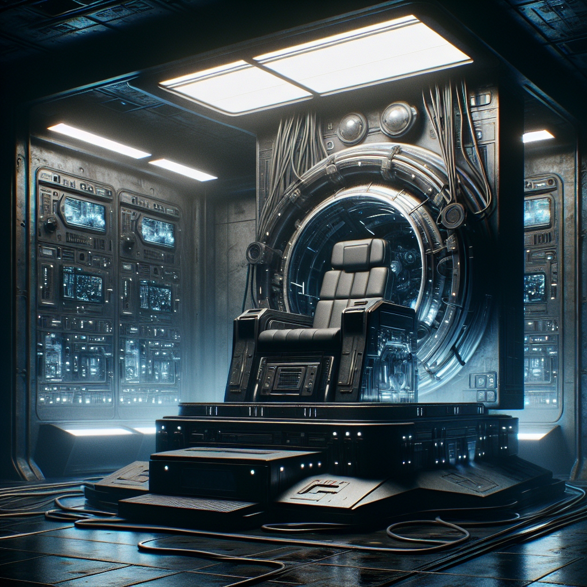
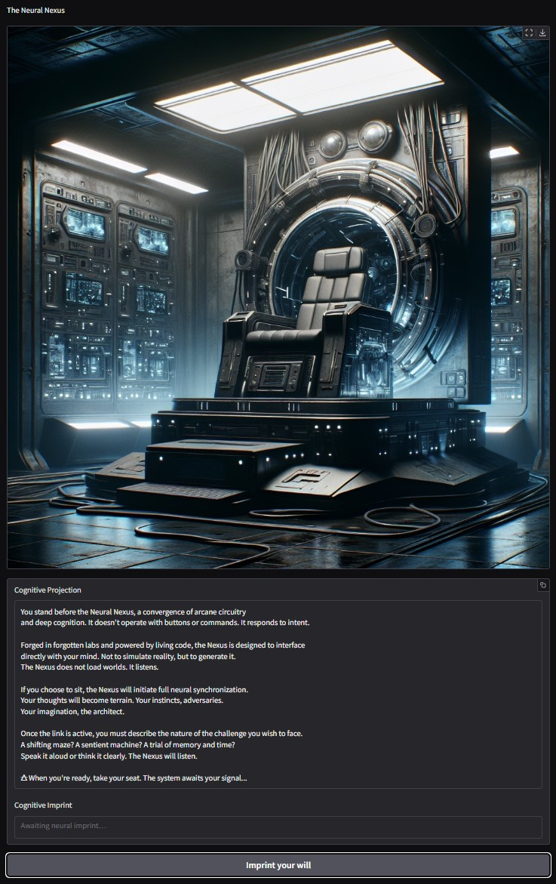
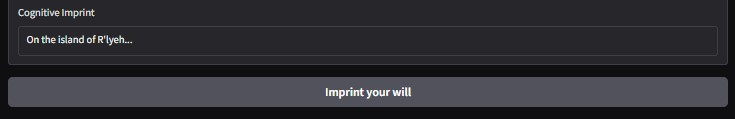
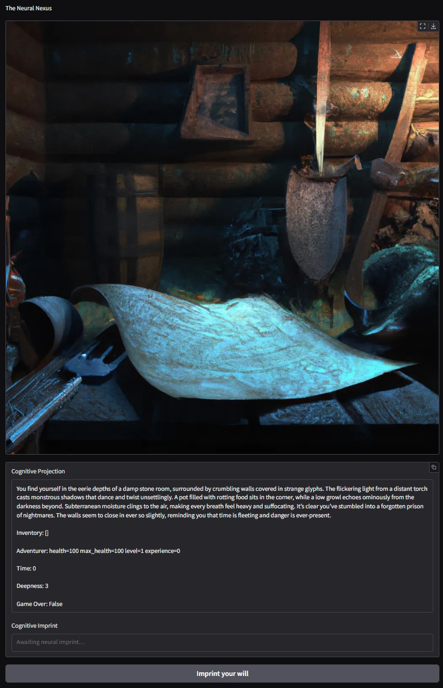
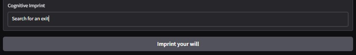
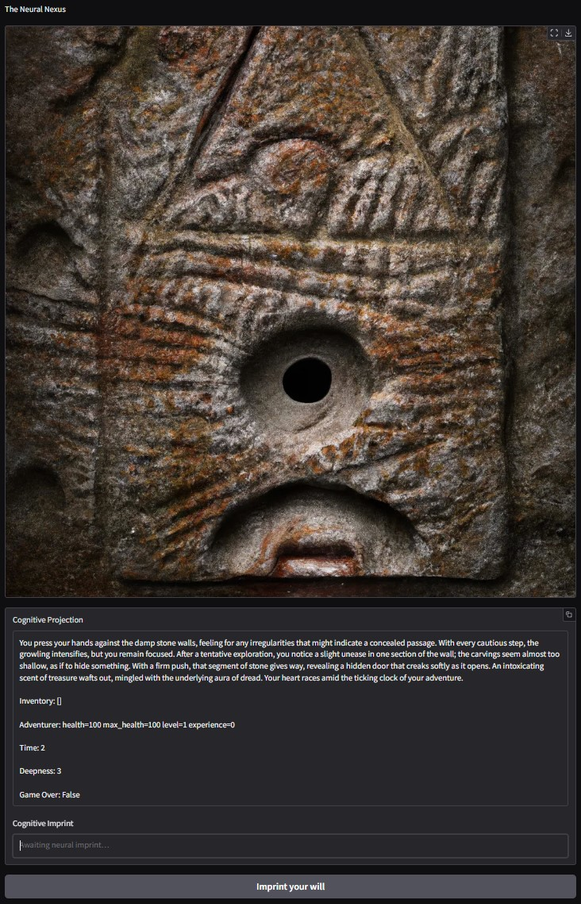
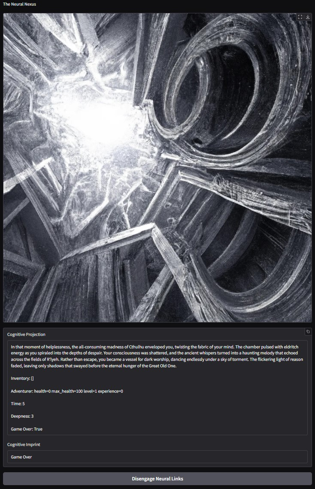

# 神经联系

<!--  -->

待办事项：

* 为用户输入设置界限。
* 为场景添加声音
* 为游戏大师的描述添加配音。
* 添加语音输入。
* 使用视频来呈现最终场景：逃跑或死亡。
* 根据总宝藏、获得的经验值和达到的深度生成分数。

## 要求

AI服务接入配置：

* 需要一个包含访问不同 LLM 所需凭据的“.env”文件：

  * `OPENAI_API_KEY`：始终需要，因为*“讲故事的人”* 使用它。
  * `XAI_API_KEY`：如果使用 Grok 的 illustrator，则需要。
    *（不那么拘谨，更快，肖像模式）*
  * 如果使用 Gemini 的 illustrator，则需要`GOOGLE_API_KEY`。

  显然，所使用的服务必须充值少量才能生成
  响应和图像。\
  *请参阅每项服务的当前计费信息。*

illustrator 组件有 6 种变体实现，其中一些可能具有
附加依赖项：

* `illustrator_dalle_2`: *（设置为默认）*

  Dall·E 2 实现使用标准 OpenAI 客户端，并且应该开箱即用。
  尽管事实证明达尔·E有点拘谨，拒绝画一些战斗场景。

* `illustrator_dalle_3`:

  Dall·E 3 实现使用标准 OpenAI 客户端，并且应该开箱即用。
  尽管事实证明达尔·E有点拘谨，拒绝画一些战斗场景。
  该版本的图像明显优于 Dall·E 2，但成本较高

* `illustrator_grok`:

  Grok 2 Image 实现使用标准 OpenAI 客户端，并且应该在
  盒子。
  它速度更快，但不支持质量或尺寸控制。

  图像以“肖像模式”生成，因此它特别适合移动设备。

  Grok 在暴力方面不那么拘谨，可能会画战斗场景，至少是针对
  幻想敌人，还有血。

* `illustrator_gpt`:

  GPT Image illustrator 使用标准 OpenAI 客户端，应该可以开箱即用，但是
  它需要用户在 OpenAI 平台上进行验证才能访问它。

* `插画家_双子座`

  Gemini 插画使用新的 Google SDK“genai”，它取代了旧的 SDK
  在课程“generativeai”中使用，这个新的可以通过以下方式安装：

  `python -m pip install google-genai`

  *`generativeai`和`genai`可以同时安装，没有问题*

* `illustrator_grok_x`

  Grok_X illustrator 使用 xAI SDK“xai-sdk”，可以通过以下方式安装：

  `python -m pip 安装 xai-sdk`

## 配置服务和游戏

所有服务和游戏值都可以在“config.py”文件中设置。

将“DRAW_FUNCTION”设置为“None”将禁用图像生成并修复
将使用图像。

## 游戏启动

游戏可以从终端启动，只需导航到游戏的根文件夹

* `cd 社区贡献\dungeon_extraction_game`

并运行以下命令：

* `python -m 游戏`\
  *请注意，由于项目的结构和导入策略，需要“-m”。*

游戏将需要几秒钟来设置服务和配置，然后日志将开始显示
显示，其中包括服务地址。

它将尝试将您的默认浏览器直接启动到游戏页面。

可以通过在同一终端上按“ctrl + c”来停止游戏。

## 玩游戏

进入浏览器后，将显示开始屏幕：

您应该在下方的框中输入您想玩的游戏类型并提交。

您的输入可以简单到一个单词，例如“太空飞船”，也可以详细到您
喜欢。

从那时起，只有你的想象力（和讲故事的人）才能设定限制。

提交后，图像将更新以反映场景，并附有描述，
你的库存、你的冒险家的状态，有时还有一些关于做什么的建议
接下来。

虽然游戏以英语开始，但如果你切换到另一种语言，故事讲述者
理解，它将无缝地以该语言继续。

您可以自由地输入您想要的任何动作，讲故事的人会适应。
尽管如此，它还是被指示要保持世界的连贯性，所以不要指望它会完全消失
铁轨。

游戏就这样继续进行

直到你带着你的宝藏逃跑......
或迎接你的结局。

按住底部按钮即可重新开始新游戏。